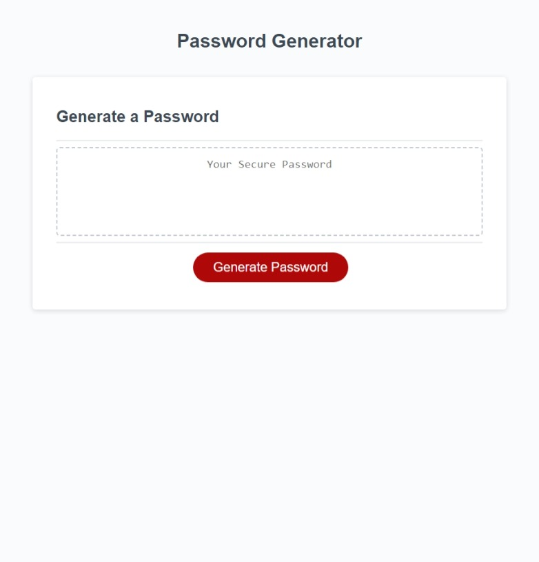

# Password Generator

## Webpage Description
This is a password generator. When the user clicks on the "Generate Password" button, they are presented with a series of prompts for password criteria withc include:
- Picking a password length of at least 8 and no more than 128 characters
- Include lowercase characters?
- Include uppercase characters?
- Include numbers?
- Include special characters?

The input by the user is then validated.
- If the user cancels out of picking a password length, the prompt window closes and no password is generated. 
- If the user enters an invalid number, they are alerted of this and asked to enter a new number. Invalid number include:
  - a string (ex. dog or nine)
  - value lower than 8 (ex. 4 or -14)
  - value higher than 128 (ex. 500)
  - not a whole number (ex. 14.5)

Once validated, the password generator will make sure that one character of each type is selected and added to the start of the password. Then the remaining characters of the password are randomly picked out of any character type the user has specified.

The password is then written to the page inside of the box above the "Generate Password" button.

## Link to Website
The deployed website can be accesed [here](https://wald14.github.io/password_generator/)

## Acknowledgements
- Gary Almes - provided the class with the main structure of the function generateRandomNumber() during a class demo.

## Site Preview
The following image shares the web application's apperance:
 

